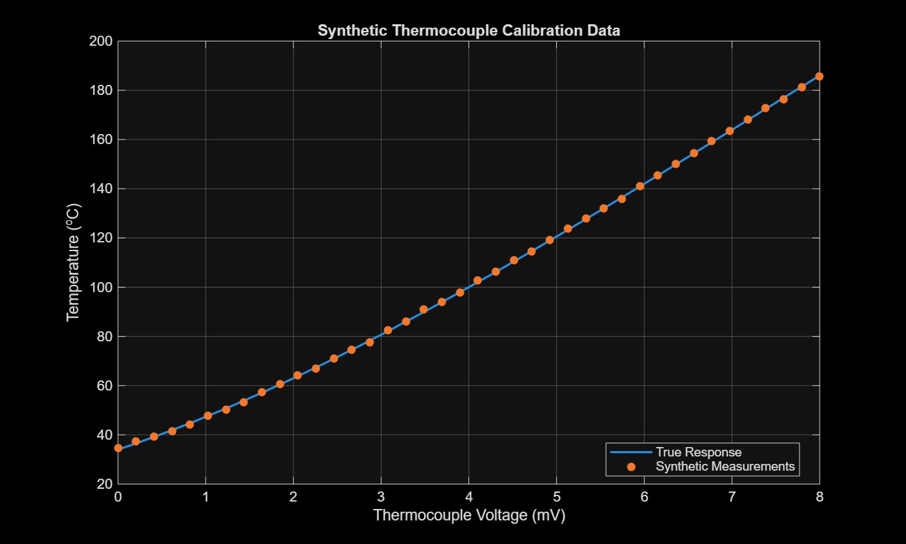
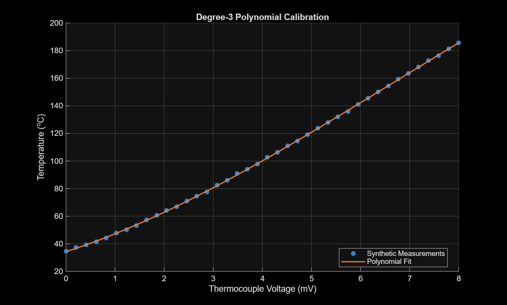
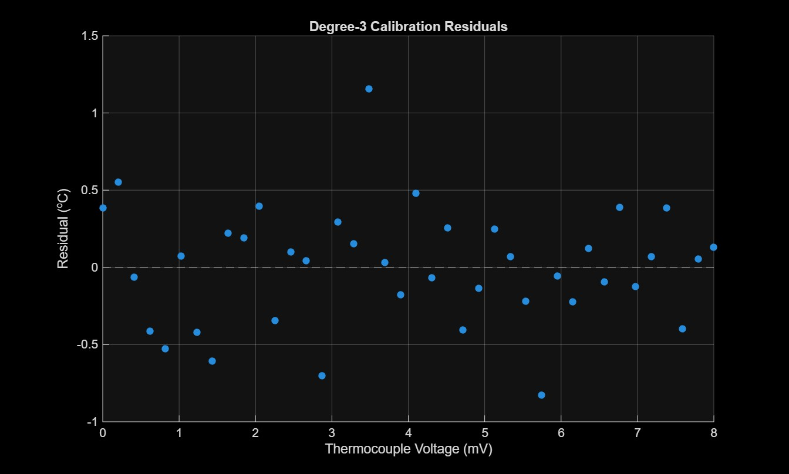
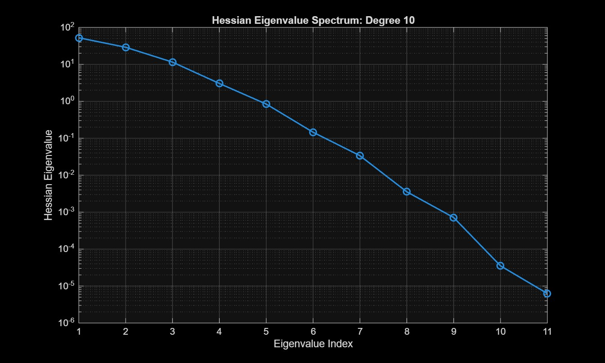
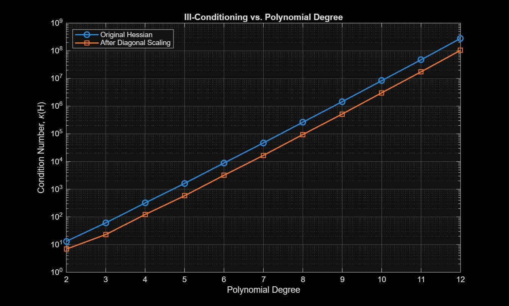
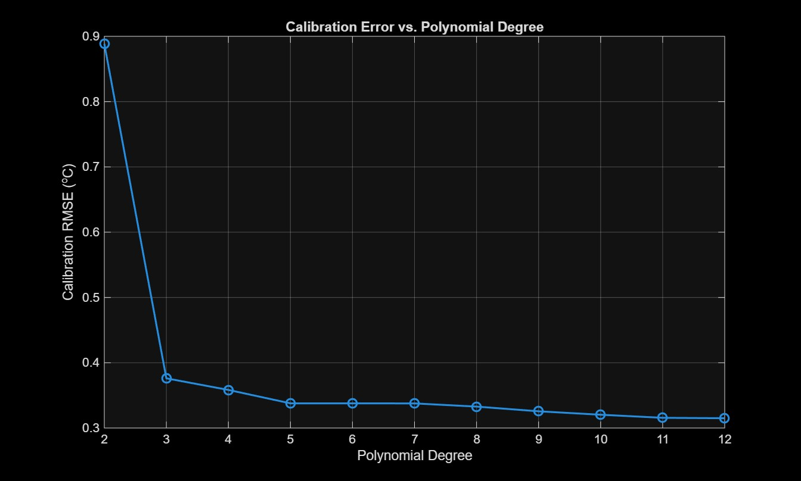
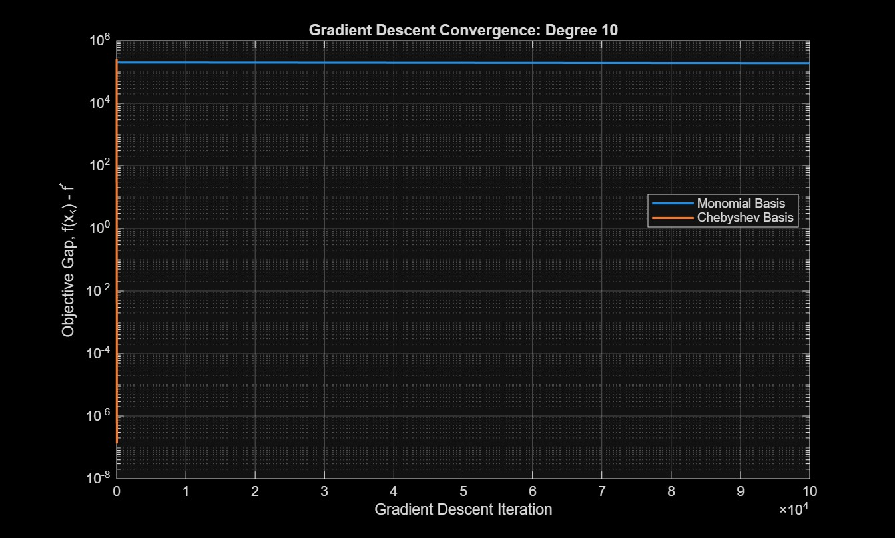
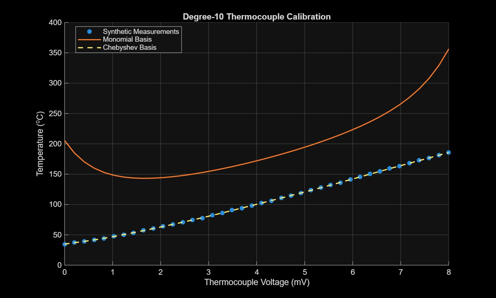

# Project 2: Ill-Conditioning in Polynomial Thermocouple Calibration

## Abstract

This project studies numerical ill-conditioning in a thermocouple-inspired calibration problem. A synthetic dataset containing 40 voltage-temperature calibration points is fit using polynomial least squares. The problem belongs to **Family C: correlated / multiscale features** because the monomial basis produces a Vandermonde design matrix whose columns become increasingly correlated as polynomial degree increases. The least-squares Hessian is

$$
H=X^T X,
$$

so this loss of independence between columns produces a rapidly increasing condition number. The condition number increased from approximately $13.1$ at degree 2 to $2.80\times 10^8$ at degree 12. Diagonal Jacobi scaling did not eliminate the problem; at degree 12 the scaled condition number remained $1.04\times10^8$, demonstrating intrinsic rather than trivial scale-based ill-conditioning. For a degree-10 model, the monomial Hessian had $\kappa=8.34\times10^6$, while an equivalent Chebyshev basis reduced the condition number to $5.47$. With the same relative-gradient tolerance of $10^{-6}$, monomial-basis gradient descent failed to converge within 100,000 iterations, whereas the Chebyshev formulation converged in 38 iterations. These results show that the calibration model can remain accurate while its numerical parameterization becomes extremely difficult to optimize.

---

## 1. Problem Identification and Motivation

Thermocouples are commonly used to measure temperature in mechanical and thermal experiments. The sensor produces a voltage that must be related to temperature through calibration. In experimental work, the measured calibration points contain scatter and uncertainty, so a fitted mathematical relationship is often used to convert measured voltage into temperature.

This project uses a **synthetic thermocouple-inspired dataset** rather than laboratory data. The synthetic dataset gives a controlled test environment: the same calibration points can be used for every optimization experiment, and numerical conditioning can be studied without introducing missing measurements, sensor drift, or other uncontrolled laboratory effects.

The dataset contains 40 calibration points over a voltage range of 0 to 8 mV. The measured temperature range is approximately $34.64^\circ\mathrm C$ to $185.75^\circ\mathrm C$. Small random measurement errors were included when the dataset was created to mimic calibration scatter.



The main question is:

> **How does increasing polynomial order in a thermocouple calibration model affect numerical conditioning and gradient-descent convergence, and can a Chebyshev basis improve the optimization without changing the underlying polynomial model space?**

This question separates two ideas that are important in experimental mechanics. **Measurement error** describes scatter or uncertainty in the data, while **numerical ill-conditioning** describes poor geometry in the optimization problem. A calibration model may fit the data accurately but still be very difficult for an iterative optimizer to solve.

---

## 2. Formulation

### 2.1 Calibration data

For each calibration point $i=1,\ldots,N$, the dataset contains

$$
(V_i,T_i),
$$

where

- $V_i$ is thermocouple voltage in mV,
- $T_i$ is the measured calibration temperature in $^\circ\mathrm C$,
- $N=40$ is the number of calibration points.

Voltage is normalized before polynomial fitting:

$$
z_i=\frac{V_i-V_{\mathrm{mid}}}{(V_{\max}-V_{\min})/2}.
$$

For the 0 to 8 mV range,

$$
V_{\mathrm{mid}}=4\ \mathrm{mV},
$$

so

$$
z_i=\frac{V_i-4}{4},
\qquad -1\le z_i\le 1.
$$

Normalizing voltage removes a simple unit-scale explanation for poor conditioning before the intrinsic-conditioning test is performed.

### 2.2 Decision variables

A degree-d polynomial calibration model in the monomial basis is

$$
\hat T(z)=a_0+a_1z+a_2z^2+\cdots+a_dz^d.
$$

The decision vector is

$$
\mathbf a=
\begin{bmatrix}
a_0 & a_1 & \cdots & a_d
\end{bmatrix}^T
\in\mathbb R^{d+1}.
$$

The decision variables are continuous polynomial coefficients. Since $z$ is dimensionless, each term contributes to a temperature prediction in $^\circ\mathrm C$.

### 2.3 Design matrix

The model can be written as

$$
\hat{\mathbf T}=X\mathbf a,
$$

where

$$
X=
\begin{bmatrix}
1 & z_1 & z_1^2 & \cdots & z_1^d\\
1 & z_2 & z_2^2 & \cdots & z_2^d\\
\vdots & \vdots & \vdots & & \vdots\\
1 & z_N & z_N^2 & \cdots & z_N^d
\end{bmatrix}.
$$

### 2.4 Objective function

The coefficients are obtained by minimizing the least-squares objective

$$
\boxed{
\min_{\mathbf a\in\mathbb R^{d+1}}
f(\mathbf a)
=\frac12\|X\mathbf a-\mathbf T\|_2^2
}
$$

where

$$
\mathbf T=
\begin{bmatrix}
T_1&T_2&\cdots&T_N
\end{bmatrix}^T.
$$

The residual vector is

$$
\mathbf r=\mathbf T-X\mathbf a.
$$

Calibration accuracy is summarized by

$$
\mathrm{RMSE}
=\sqrt{\frac1N\sum_{i=1}^{N}(T_i-\hat T_i)^2}.
$$

For the cubic calibration model, the fitted curve follows the synthetic measurements closely and the residuals remain centered near zero.





### 2.5 Constraints and classification

There are no explicit constraints on the polynomial coefficients. The optimization problem is therefore:

- continuous,
- unconstrained,
- smooth,
- convex,
- quadratic in the decision variables,
- linear least squares.

---

## 3. Ill-Conditioning Mechanism

### 3.1 Family classification

This problem belongs to **Family C: correlated / multiscale features**.

The gradient is

$$
\nabla f(\mathbf a)=X^T(X\mathbf a-\mathbf T),
$$

and the Hessian is

$$
\boxed{H=X^T X}.
$$

The Hessian condition number is

$$
\boxed{
\kappa(H)=\frac{\lambda_{\max}(H)}{\lambda_{\min}(H)}
}.
$$

As polynomial degree increases, the monomial columns

$$
1,\ z,\ z^2,\ z^3,\ldots,z^d
$$

become increasingly correlated over the finite interval $[-1,1]$. This makes the Vandermonde design matrix increasingly close to rank deficient. Because $H=X^TX$, small singular values of $X$ become small Hessian eigenvalues. The resulting spread between $\lambda_{\min}$ and $\lambda_{\max}$ produces a large condition number and a narrow optimization valley.

### 3.2 Structural knob: polynomial degree

The calibration dataset is held fixed while polynomial degree is increased from 2 through 12. This gives a controlled structural knob:

$$
d\uparrow
\Rightarrow
\text{basis correlation}\uparrow
\Rightarrow
\lambda_{\min}(H)\downarrow
\Rightarrow
\kappa(H)\uparrow.
$$

The measured trend strongly supports this mechanism. The Hessian condition number grew from $13.1$ at degree 2 to approximately $2.80\times10^8$ at degree 12.

### 3.3 Intrinsic-κ test

To determine whether the large condition number is merely caused by coordinate scale, symmetric Jacobi scaling is applied:

$$
D=diag(H),
$$

$$
\boxed{
H_s=D^{-1/2}HD^{-1/2}.
}
$$

If the problem were only a units mismatch, this diagonal scaling would reduce the condition number to order one. That did not occur. At degree 10,

$$
\kappa(H)=8.34\times10^6,
$$

while the scaled matrix still had

$$
\kappa(H_s)=3.04\times10^6.
$$

At degree 12, the values were approximately

$$
\kappa(H)=2.80\times10^8,
\qquad
\kappa(H_s)=1.04\times10^8.
$$

Therefore, diagonal scaling reduces the magnitude somewhat but does **not** cure the problem. The ill-conditioning survives because it is caused primarily by correlation between basis directions, satisfying the intrinsic-conditioning requirement.

### 3.4 Small-case verification

For the cubic model, MATLAB produced

$$
\lambda_{\min}=0.7432358,
\qquad
\lambda_{\max}=45.37672.
$$

Thus,

$$
\frac{\lambda_{\max}}{\lambda_{\min}}
=61.05293.
$$

MATLAB's `cond(H)` also returned

$$
\kappa(H)=61.05293,
$$

confirming the condition-number calculation independently.

---

## 4. Effect of Ill-Conditioning

### 4.1 D1 — Hessian spectrum and condition number

The degree-10 monomial model is used as a representative ill-conditioned case. Its Hessian has approximately

$$
\lambda_{\min}=6.28\times10^{-6},
$$

$$
\lambda_{\max}=52.43,
$$

which gives

$$
\boxed{\kappa(H)=8.34\times10^6}.
$$

The degree-10 Hessian eigenvalue spectrum is shown below on a logarithmic scale.



The several-orders-of-magnitude spread in eigenvalues corresponds to a highly elongated objective landscape.

### 4.2 D2 — Condition number versus polynomial degree

The full conditioning sweep is summarized below.

| Degree | $\kappa(H)$ | $\kappa(H_s)$ | Direct least-squares RMSE ($^\circ\mathrm C$) |
|---:|---:|---:|---:|
| 2 | 13.124 | 6.8637 | 0.88867 |
| 3 | 61.053 | 23.067 | 0.37613 |
| 4 | 318.89 | 122.32 | 0.35835 |
| 5 | 1,628.6 | 579.72 | 0.33781 |
| 6 | 8,843.8 | 3,191.3 | 0.33778 |
| 7 | 47,214 | 16,681 | 0.33770 |
| 8 | $2.6366\times10^5$ | 94,538 | 0.33281 |
| 9 | $1.4550\times10^6$ | $5.2153\times10^5$ | 0.32561 |
| 10 | $8.3428\times10^6$ | $3.0350\times10^6$ | 0.32035 |
| 11 | $4.7474\times10^7$ | $1.7442\times10^7$ | 0.31565 |
| 12 | $2.7997\times10^8$ | $1.0437\times10^8$ | 0.31498 |

The intrinsic-conditioning trend is shown below.



The key observation is that fit error improves only modestly while conditioning deteriorates dramatically. From degree 3 to degree 12, RMSE decreases from approximately $0.376^\circ\mathrm C$ to $0.315^\circ\mathrm C$, while the Hessian condition number increases from about $61$ to $2.80\times10^8$.



### 4.3 D3 — Baseline gradient descent

Gradient descent is used as the baseline first-order optimizer:

$$
\mathbf a_{k+1}
=\mathbf a_k-\alpha\nabla f(\mathbf a_k).
$$

For the quadratic least-squares problem, the fixed step size is selected as

$$
\boxed{
\alpha=\frac{2}{L+\mu}
}
$$

with

$$
L=\lambda_{\max}(H),
\qquad
\mu=\lambda_{\min}(H).
$$

The stopping criterion is

$$
\frac{\|\nabla f(\mathbf a_k)\|_2}
{\|\nabla f(\mathbf a_0)\|_2}
\le10^{-6}.
$$

The convergence history plots the objective gap $f(\mathbf a_k)-f^*$ on a semilog axis.

For the degree-10 monomial problem, gradient descent reached the imposed limit of **100,000 iterations without satisfying the tolerance**. Its final calibration RMSE was still

$$
97.8904^\circ\mathrm C.
$$

This poor RMSE should not be interpreted as a limitation of the degree-10 polynomial itself. Solving the **same monomial least-squares model directly** gives an RMSE of only

$$
0.32035^\circ\mathrm C.
$$

Therefore, the degree-10 model is capable of fitting the data well; gradient descent simply cannot reach that optimum efficiently in the badly conditioned monomial coordinates.

---

## 5. Proposed Solution and Demonstration

### 5.1 Chebyshev reparameterization

The identified mechanism is strong correlation among monomial basis functions. The remedy is therefore to represent the same polynomial model space using Chebyshev polynomials, which provide much better separated basis directions on $[-1,1]$.

The basis is defined by

$$
T_0(z)=1,
$$

$$
T_1(z)=z,
$$

and

$$
T_n(z)=2zT_{n-1}(z)-T_{n-2}(z).
$$

The calibration model becomes

$$
\hat T(z)
=c_0T_0(z)+c_1T_1(z)+\cdots+c_dT_d(z).
$$

This is a **reparameterization**, not a change in physical model class. A degree-d polynomial in a Chebyshev basis spans the same degree-d polynomial space as a degree-d polynomial in the monomial basis.

### 5.2 D4 — Before/after conditioning

For degree 10, the measured condition numbers are

| Formulation | $\kappa(H)$ |
|---|---:|
| Monomial basis | $8.34285\times10^6$ |
| Chebyshev basis | $5.47280$ |

The condition number therefore decreases by approximately

$$
\frac{8.34285\times10^6}{5.47280}
\approx1.52\times10^6.
$$

In other words, the reparameterization improves the Hessian condition number by roughly **1.5 million times** for this degree-10 calibration problem.

### 5.3 D4 — Before/after convergence

Using the same relative-gradient tolerance of $10^{-6}$ and the optimal fixed step for each Hessian gives:

| Metric | Monomial basis | Chebyshev basis |
|---|---:|---:|
| Polynomial degree | 10 | 10 |
| $\kappa(H)$ | $8.34285\times10^6$ | 5.47280 |
| Gradient-descent iterations | 100,000 limit reached | 38 |
| Final GD RMSE ($^\circ\mathrm C$) | 97.8904 | 0.32035 |
| Direct least-squares RMSE ($^\circ\mathrm C$) | 0.32035 | approximately the same model-space optimum |

The baseline-versus-remedy convergence history is shown below.



Because the Chebyshev method converges in only 38 iterations while the monomial run continues to 100,000 iterations, its entire convergence history is compressed near the left edge of the shared horizontal axis. The difference is not caused by increased model flexibility. Both formulations represent the same degree-10 polynomial space. Instead, the Chebyshev basis changes the optimization coordinates so that the Hessian eigenvalues are much more tightly clustered. Gradient descent can then make useful progress in all curvature directions with a single fixed step size.

### 5.4 Calibration-fit interpretation

The direct degree-10 monomial least-squares solution has an RMSE of $0.32035^\circ\mathrm C$, demonstrating that the monomial model is capable of fitting the calibration data accurately. The failed gradient-descent result of $97.8904^\circ\mathrm C$ is therefore a **solver-convergence result**, not a statement that the degree-10 monomial polynomial is a poor calibration model.

The Chebyshev formulation reaches the same practical calibration accuracy in only 38 gradient-descent iterations. This cleanly separates **model quality** from **optimization quality**.



In Figure 8, the orange "Monomial Basis" curve is the **unconverged monomial gradient-descent iterate after 100,000 iterations**, not the direct least-squares monomial solution. The direct monomial solution achieves the same $0.32035^\circ\mathrm C$ RMSE as the converged Chebyshev solution to the displayed precision.

---

## 6. Assumptions and Simplifications

1. **Synthetic thermocouple-inspired data.** The dataset is not a manufacturer-specific thermocouple standard curve. It is used to isolate numerical-conditioning behavior in a controlled calibration example.
2. **Fixed dataset.** The same 40 points are used for every polynomial degree so degree is the primary structural knob.
3. **Normalized voltage.** Voltage is mapped to $[-1,1]$ before fitting to remove trivial unit-scale effects.
4. **Independent synthetic measurement scatter.** The dataset includes small random errors, but it is not intended to reproduce every real thermocouple uncertainty source.
5. **Unweighted least squares.** Every calibration point receives equal weight.
6. **No extrapolation analysis.** Results are interpreted only over the calibration interval.
7. **No claim that high polynomial order is physically optimal.** Degrees up to 12 are used to expose the conditioning mechanism, not to recommend a real thermocouple calibration standard.
8. **Gradient descent is intentionally diagnostic.** For a small linear least-squares problem, MATLAB's direct solver is more appropriate computationally. Gradient descent is used here because its convergence strongly exposes the effect of Hessian conditioning.
9. **Finite iteration cap.** Gradient descent is limited to 100,000 iterations. Failure to reach the specified tolerance within this limit is reported as nonconvergence within the computational budget.

---

## 7. Discussion

The results show a strong separation between **calibration accuracy** and **numerical optimization difficulty**. Increasing degree from 3 to 12 reduces the direct least-squares RMSE by only about $0.061^\circ\mathrm C$, from $0.376^\circ\mathrm C$ to $0.315^\circ\mathrm C$. Over the same change, the Hessian condition number increases from approximately $61$ to $2.80\times10^8$.

This means that a small improvement in fit quality can come with an enormous numerical penalty when the monomial basis is used. The result is particularly relevant to calibration problems because examining residuals alone may suggest that a high-order model is acceptable, even while the associated optimization problem becomes extremely poorly conditioned.

The diagonal-rescaling test confirms that this is not just a units problem. At degree 12, Jacobi scaling still leaves $\kappa\approx1.04\times10^8$. The source is therefore the geometry of the basis itself: high-order monomial columns become nearly linearly dependent.

The gradient-descent experiment demonstrates the practical consequence. At degree 10, the direct monomial least-squares solution achieves $0.32035^\circ\mathrm C$ RMSE, so the model has sufficient expressive capability. However, monomial-basis gradient descent is still far from that solution after 100,000 iterations and has a final RMSE of $97.89^\circ\mathrm C$. This failure is consistent with the extremely large condition number $8.34\times10^6$.

The Chebyshev basis directly addresses the identified mechanism rather than changing the data or adding a different objective. It reduces the degree-10 condition number to only $5.47$ and reaches the gradient tolerance in 38 iterations. The approximately $1.52\times10^6$-fold condition-number reduction provides strong before/after evidence that the original difficulty was a basis-conditioning problem.

---

## 8. Conclusion

This project formulated thermocouple calibration as a polynomial least-squares optimization problem and investigated how polynomial parameterization affects numerical conditioning. The problem was classified as **Family C: correlated / multiscale features** because increasingly correlated monomial columns make the Vandermonde design matrix nearly rank deficient as polynomial degree increases.

The required diagnostics produced four main results:

1. **D1 — Spectrum and condition number.** For the degree-10 monomial model, the Hessian eigenvalues ranged from approximately $6.28\times10^{-6}$ to $52.43$, producing $\kappa(H)=8.34\times10^6$.
2. **D2 — Intrinsic conditioning.** The condition number grew from $13.1$ at degree 2 to $2.80\times10^8$ at degree 12. Diagonal scaling did not cure the problem; the degree-12 scaled condition number remained $1.04\times10^8$.
3. **D3 — Optimization effect.** Degree-10 monomial gradient descent failed to satisfy the $10^{-6}$ relative-gradient tolerance within 100,000 iterations even though the direct least-squares solution fits the same data with $0.32035^\circ\mathrm C$ RMSE.
4. **D4 — Remedy.** Changing to a Chebyshev basis reduced the degree-10 condition number from $8.34\times10^6$ to $5.47$ and reduced gradient-descent convergence from more than 100,000 iterations to 38 iterations.

The main conclusion is that **the mathematical model can be accurate while its coordinates are numerically poor**. For polynomial calibration, changing from a monomial basis to a Chebyshev basis preserves the underlying polynomial model space while dramatically improving the geometry seen by the optimizer.

---

## 9. Reproducibility

Place the following files in the same MATLAB working directory:

```text
synthetic_thermocouple_calibration.csv
thermocouple_ill_conditioning.m
```

Run:

```matlab
thermocouple_ill_conditioning
```

The CSV contains the fixed synthetic dataset used for all reported results. The MATLAB script performs the degree sweep, Hessian and eigenvalue analysis, diagonal-scaling test, gradient-descent experiment, Chebyshev reformulation, and final comparison.

### MATLAB code

```matlab
%% Project 2 - Ill-Conditioning in Thermocouple Calibration
% Family C: Correlated / multiscale features
% Synthetic thermocouple-inspired polynomial calibration
%
% Baseline formulation: monomial polynomial basis
% Remedy: Chebyshev polynomial basis

clear;
clc;
close all;

%% 1. Import synthetic thermocouple calibration data

data = readtable('synthetic_thermocouple_calibration.csv');

V = data.Voltage_mV;        % Thermocouple voltage [mV]
z = data.z_normalized;      % Normalized voltage [-1,1]
T_true = data.T_true_C;     % Noise-free synthetic temperature [deg C]
T_meas = data.T_measured_C; % Synthetic measured temperature [deg C]

N = length(V);

fprintf('---------------------------------------------\n');
fprintf('THERMOCOUPLE CALIBRATION DATA\n');
fprintf('---------------------------------------------\n');
fprintf('Number of calibration points: %d\n', N);
fprintf('Voltage range: %.2f to %.2f mV\n', min(V), max(V));
fprintf('Measured temperature range: %.2f to %.2f deg C\n\n', ...
    min(T_meas), max(T_meas));

%% 2. Plot synthetic calibration data

figure;
plot(V, T_true, 'LineWidth', 1.5);
hold on;
scatter(V, T_meas, 35, 'filled');
xlabel('Thermocouple Voltage (mV)');
ylabel('Temperature (^oC)');
title('Synthetic Thermocouple Calibration Data');
legend('True Response', 'Synthetic Measurements', 'Location', 'best');
grid on;

%% 3. Initial low-order polynomial calibration

d = 3;
X = buildMonomialMatrix(z, d);

a = X \ T_meas;
T_fit = X * a;
residuals = T_meas - T_fit;
RMSE = sqrt(mean(residuals.^2));

fprintf('---------------------------------------------\n');
fprintf('DEGREE-%d CALIBRATION\n', d);
fprintf('---------------------------------------------\n');
fprintf('Polynomial coefficients:\n');
disp(a);
fprintf('RMSE = %.6f deg C\n\n', RMSE);

%% 4. Plot degree-3 calibration fit

figure;
scatter(V, T_meas, 35, 'filled');
hold on;
plot(V, T_fit, 'LineWidth', 1.5);
xlabel('Thermocouple Voltage (mV)');
ylabel('Temperature (^oC)');
title('Degree-3 Polynomial Calibration');
legend('Synthetic Measurements', 'Polynomial Fit', 'Location', 'best');
grid on;

%% 5. Plot calibration residuals

figure;
scatter(V, residuals, 35, 'filled');
hold on;
yline(0, '--');
xlabel('Thermocouple Voltage (mV)');
ylabel('Residual (^oC)');
title('Degree-3 Calibration Residuals');
grid on;

%% 6. D1 - Hessian and conditioning for degree-3 problem

H = X' * X;
lambda = sort(eig(H));

lambda_min = min(lambda);
lambda_max = max(lambda);

kappa_eigenvalues = lambda_max / lambda_min;
kappa_matlab = cond(H);

fprintf('---------------------------------------------\n');
fprintf('DEGREE-%d HESSIAN ANALYSIS\n', d);
fprintf('---------------------------------------------\n');
fprintf('Minimum eigenvalue       = %.6e\n', lambda_min);
fprintf('Maximum eigenvalue       = %.6e\n', lambda_max);
fprintf('Kappa from eigenvalues   = %.6e\n', kappa_eigenvalues);
fprintf('Kappa from cond(H)        = %.6e\n\n', kappa_matlab);

%% 7. D2 - Sweep polynomial degree and test intrinsic conditioning

degrees = 2:12;
numDegrees = length(degrees);

kappa_monomial = zeros(numDegrees,1);
kappa_scaled = zeros(numDegrees,1);
RMSE_degree = zeros(numDegrees,1);

for i = 1:numDegrees
    d_i = degrees(i);

    X_i = buildMonomialMatrix(z, d_i);
    H_i = X_i' * X_i;

    kappa_monomial(i) = cond(H_i);

    % Symmetric Jacobi / diagonal scaling
    D = diag(diag(H_i));
    D_inv_sqrt = diag(1 ./ sqrt(diag(D)));
    H_scaled = D_inv_sqrt * H_i * D_inv_sqrt;

    kappa_scaled(i) = cond(H_scaled);

    % Calibration accuracy
    a_i = X_i \ T_meas;
    T_fit_i = X_i * a_i;
    residual_i = T_meas - T_fit_i;
    RMSE_degree(i) = sqrt(mean(residual_i.^2));
end

%% 8. Plot condition number versus polynomial degree

figure;
semilogy(degrees, kappa_monomial, '-o', 'LineWidth', 1.5, 'MarkerSize', 7);
hold on;
semilogy(degrees, kappa_scaled, '-s', 'LineWidth', 1.5, 'MarkerSize', 7);
xlabel('Polynomial Degree');
ylabel('Condition Number, \kappa(H)');
title('Ill-Conditioning vs. Polynomial Degree');
legend('Original Hessian', 'After Diagonal Scaling', 'Location', 'northwest');
grid on;

%% 9. Calibration RMSE versus polynomial degree

figure;
plot(degrees, RMSE_degree, '-o', 'LineWidth', 1.5, 'MarkerSize', 7);
xlabel('Polynomial Degree');
ylabel('Calibration RMSE (^oC)');
title('Calibration Error vs. Polynomial Degree');
grid on;

%% 10. Conditioning results table

conditioningTable = table( ...
    degrees', ...
    kappa_monomial, ...
    kappa_scaled, ...
    RMSE_degree, ...
    'VariableNames', ...
    {'Degree','Kappa_Monomial','Kappa_Scaled','RMSE_degC'});

disp(' ');
disp('CONDITIONING RESULTS');
disp(conditioningTable);

%% 11. D1 - Hessian eigenvalue spectrum for an ill-conditioned case

d_bad = 10;
X_bad = buildMonomialMatrix(z, d_bad);
H_bad = X_bad' * X_bad;
lambda_bad = sort(eig(H_bad), 'descend');

figure;
semilogy(1:length(lambda_bad), lambda_bad, 'o-', 'LineWidth', 1.5, 'MarkerSize', 7);
xlabel('Eigenvalue Index');
ylabel('Hessian Eigenvalue');
title(sprintf('Hessian Eigenvalue Spectrum: Degree %d', d_bad));
grid on;

%% 12. D3 - Baseline gradient descent using monomial basis

d_GD = 10;

X_GD = buildMonomialMatrix(z, d_GD);
H_GD = X_GD' * X_GD;

lambda_GD = eig(H_GD);
lambda_min_GD = min(lambda_GD);
lambda_max_GD = max(lambda_GD);

% Optimal fixed step size for an SPD quadratic
alpha_GD = 2 / (lambda_max_GD + lambda_min_GD);

a0 = zeros(d_GD + 1, 1);
maxIter = 100000;
tol = 1e-6;

[a_GD, history_mono, iterations_mono] = ...
    gradientDescentLS(X_GD, T_meas, a0, alpha_GD, maxIter, tol);

%% 13. D4 - Chebyshev basis remedy

X_cheb = buildChebyshevMatrix(z, d_GD);
H_cheb = X_cheb' * X_cheb;
kappa_cheb = cond(H_cheb);

fprintf('---------------------------------------------\n');
fprintf('MONOMIAL VS CHEBYSHEV CONDITIONING\n');
fprintf('---------------------------------------------\n');
fprintf('Polynomial degree: %d\n', d_GD);
fprintf('Monomial condition number   = %.6e\n', cond(H_GD));
fprintf('Chebyshev condition number  = %.6e\n\n', kappa_cheb);

%% 14. Gradient descent using Chebyshev basis

lambda_cheb = eig(H_cheb);
lambda_min_cheb = min(lambda_cheb);
lambda_max_cheb = max(lambda_cheb);

alpha_cheb = 2 / (lambda_max_cheb + lambda_min_cheb);

c0 = zeros(d_GD + 1, 1);

[c_GD, history_cheb, iterations_cheb] = ...
    gradientDescentLS(X_cheb, T_meas, c0, alpha_cheb, maxIter, tol);

%% 15. D4 - Compare gradient-descent convergence

figure;
semilogy(0:length(history_mono)-1, history_mono, 'LineWidth', 1.5);
hold on;
semilogy(0:length(history_cheb)-1, history_cheb, 'LineWidth', 1.5);
xlabel('Gradient Descent Iteration');
ylabel('Objective Gap, f(x_k) - f^*');
title(sprintf('Gradient Descent Convergence: Degree %d', d_GD));
legend('Monomial Basis', 'Chebyshev Basis', 'Location', 'best');
grid on;

%% 16. Compare iteration counts

fprintf('---------------------------------------------\n');
fprintf('GRADIENT DESCENT COMPARISON\n');
fprintf('---------------------------------------------\n');
fprintf('Tolerance = %.1e relative initial gradient norm\n', tol);
fprintf('Monomial iterations  = %d\n', iterations_mono);
fprintf('Chebyshev iterations = %d\n\n', iterations_cheb);

%% 17. Compare final calibration curves and RMSE

T_fit_mono = X_GD * a_GD;
T_fit_cheb = X_cheb * c_GD;

RMSE_mono = sqrt(mean((T_meas - T_fit_mono).^2));
RMSE_cheb = sqrt(mean((T_meas - T_fit_cheb).^2));

figure;
scatter(V, T_meas, 35, 'filled');
hold on;
plot(V, T_fit_mono, 'LineWidth', 1.5);
plot(V, T_fit_cheb, '--', 'LineWidth', 1.5);
xlabel('Thermocouple Voltage (mV)');
ylabel('Temperature (^oC)');
title(sprintf('Degree-%d Thermocouple Calibration', d_GD));
legend('Synthetic Measurements', 'Monomial Basis', 'Chebyshev Basis', 'Location', 'best');
grid on;

fprintf('Final monomial RMSE   = %.6f deg C\n', RMSE_mono);
fprintf('Final Chebyshev RMSE  = %.6f deg C\n', RMSE_cheb);

%% 18. Final summary table

summaryTable = table( ...
    cond(H_GD), ...
    cond(H_cheb), ...
    iterations_mono, ...
    iterations_cheb, ...
    RMSE_mono, ...
    RMSE_cheb, ...
    'VariableNames', ...
    {'Kappa_Monomial', ...
     'Kappa_Chebyshev', ...
     'Iterations_Monomial', ...
     'Iterations_Chebyshev', ...
     'RMSE_Monomial', ...
     'RMSE_Chebyshev'});

disp(' ');
disp('FINAL COMPARISON');
disp(summaryTable);

%% ================================================================
% LOCAL FUNCTIONS
% ================================================================

function X = buildMonomialMatrix(z, d)
%BUILDMONOMIALMATRIX Build X = [1 z z^2 ... z^d].

    N = length(z);
    X = zeros(N, d + 1);

    for j = 0:d
        X(:, j + 1) = z.^j;
    end
end

function X = buildChebyshevMatrix(z, d)
%BUILDCHEBYSHEVMATRIX Build Chebyshev design matrix using recurrence.
% T0(z) = 1
% T1(z) = z
% Tn(z) = 2*z*T_(n-1)(z) - T_(n-2)(z)

    N = length(z);
    X = zeros(N, d + 1);

    X(:,1) = 1;

    if d >= 1
        X(:,2) = z;
    end

    for j = 2:d
        X(:,j+1) = 2 .* z .* X(:,j) - X(:,j-1);
    end
end

function [x, history, iterations] = ...
    gradientDescentLS(X, y, x0, alpha, maxIter, tol)
%GRADIENTDESCENTLS Gradient descent for
%   f(x) = 1/2 ||X*x - y||^2
%
% Stops when
%   ||grad f(x_k)|| <= tol * ||grad f(x_0)||
%
% history stores the requested diagnostic quantity
%   f(x_k) - f^*.

    x = x0;

    % Direct least-squares optimum used only as a reference
    x_star = X \ y;
    residual_star = X*x_star - y;
    f_star = 0.5 * (residual_star' * residual_star);

    % Reference gradient norm for relative stopping criterion
    residual0 = X*x0 - y;
    gradient0 = X' * residual0;
    grad_ref = norm(gradient0);

    if grad_ref == 0
        grad_ref = 1;
    end

    history = zeros(maxIter + 1, 1);

    for k = 0:maxIter
        residual = X*x - y;
        f = 0.5 * (residual' * residual);
        gradient = X' * residual;

        % D3 convergence metric
        objectiveGap = max(f - f_star, eps);
        history(k + 1) = objectiveGap;

        % Relative-gradient stopping condition
        if norm(gradient) <= tol * grad_ref
            iterations = k;
            history = history(1:k+1);
            return;
        end

        % Gradient descent update
        x = x - alpha * gradient;
    end

    iterations = maxIter;
end
```

---
